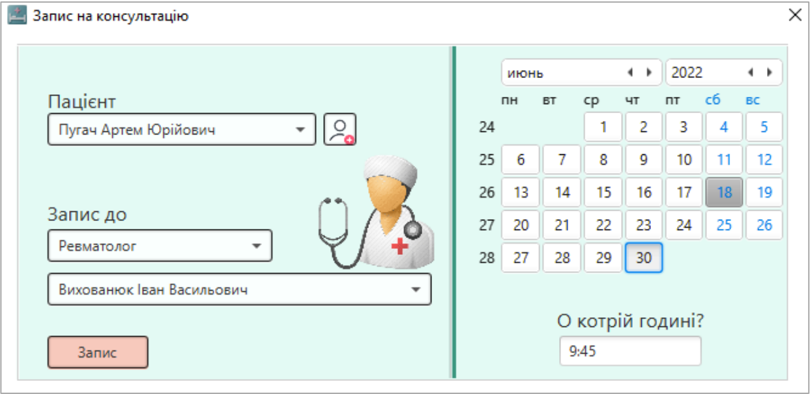

<h1 align="center"><b>Реєстратура лікарні "MedEra"</b></h1>

---

## Опис
**MedEra** - це програма, що підвищує ефективність роботи реєстратури обласних центрів первинної медико-санітарної допомоги.
У базі зберігається інформація про графік роботи спеціалістів у відповідних закладах, персональна інформація про пацієнтів, а
також наявний функціонал їх запису до лікарів. 

---

## Функціонал
+ Програма містить конфіденційну інформацію, тому реалізований процес авторизації адміністраторів. 
    > :exclamation: Перед авторизацією весь користувацький інтерфейс заблокований.

+ Відображення розкладу спеціаліста.

+ Область, що знаходиться на місці зайнятого пацієнтом часу, є клікабельною. При її натисканні відображається персональна інформація про пацієнта.

+ Запис на консультацію.

+ Створення нового пацієнта та занесення його в базу.

+ База даних про всіх пацієнтів з можливістю фільтрації даних.

---

## Стек технологій
+ Java 17
+ JDBC / MySQL
+ Maven
+ JavaFX (Controls, FXML, BootstrapFX, JFXtras) / SceneBuilder
+ Log4J
+ Javadoc